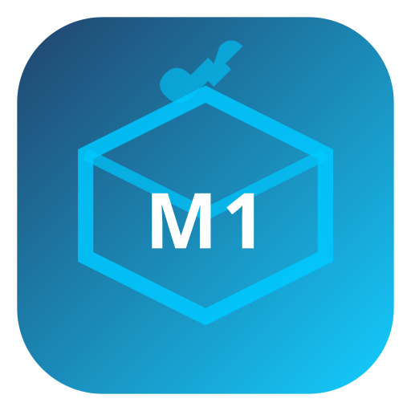

<div align="center">



# Mcaster1 Install Studio

**Cross-platform installer authoring suite — macOS, Windows, Linux.**

[](https://github.com/davestj/mcaster1-install-system/releases)
[](#build)
[](https://www.qt.io)
[](https://en.cppreference.com/w/cpp/17)
[](LICENSE)
[](#build)

Create professional installer packages for all three major platforms from a single
**YAML project file** — no external compilers, no scripting required.

---

</div>

## What Is This?

Mcaster1 Install Studio is a standalone **InstallShield / InstallAnywhere equivalent** built
on Qt6. It produces installer packages for macOS, Windows, and Linux entirely using its own
native runtime — no NSIS, no Inno Setup, no WiX, and no other third-party build tools required.

Three binaries are included:

| Binary | Purpose |
|--------|---------|
| `Mcaster1InstallStudio.app` / `.exe` | Full IDE — create, edit, and build installer projects |
| `Mcaster1Installer.app` / `.exe` | Runtime wizard — the installer your end-users run |
| `miscc` | Headless CLI compiler — build installer packages from `.mis` files |

---

## Features

### Studio IDE

- **9-tab project editor**
  - **App Info** — name, version, publisher, icon, license, install defaults, theme, target platforms
  - **Files** — component + file assignment table
  - **Components** — dependency flags, required/optional toggles
  - **Shortcuts** — Desktop / Start Menu shortcuts
  - **Registry** — Windows registry entries (HKLM/HKCU, REG_SZ/DWORD/EXPAND_SZ)
  - **Security** — code signing credentials (macOS / Windows / Linux)
  - **Prerequisites** — prerequisite check commands per platform
  - **Custom Actions** — before/after install/uninstall shell commands
  - **Build** — platform checkboxes, signing status, build queue, Test Installer
- **Multi-project workspace** — hold multiple `.mis` projects open simultaneously;
  VS Solution Explorer-style sidebar for one-click switching
- **Inline project rename** — type a new name in the sidebar; file auto-saved and renamed on disk
- **Add Application Group** — "＋" button adds a new app group (component namespace) to any project
- **Right-click context menus** — rename, delete, open in Finder/Explorer, add file, add directory,
  add shortcut; all with keyboard accelerators
- **Auto-save** — 1 500 ms timer saves dirty projects without user intervention
- **Test Installer button** — launches the runtime wizard against the active project directly
  from within Studio

### Builder Profiles

- **Per-user profiles** — company name, signing identity, email, web URL — saved to
  `AppConfigLocation/BuilderProfiles.json`
- **Signing Mode** selector on every profile:
  - **Skip code signing entirely** — unsigned build; disables all signing on all platforms
  - **Development (ad-hoc) signing** — `codesign --force --sign -` on macOS; skips
    `signtool.exe` on Windows; skips GPG on Linux; ideal for local dev and CI testing
  - **Full signing** — uses identity fields (Developer ID, PFX cert, GPG key)
- **Project list per profile** — save multiple `.mis` files to a profile for quick access
  in the sidebar; `[✕]` removes from the list (does not delete the file)
- Signing overrides applied at **build time only** — the `.mis` file on disk is never mutated

### Build Backends

#### macOS
- Output: `.dmg` disk image
- Stages app bundle into a clean `dmg_root/` directory
- Signs with `codesign` using Developer ID Application identity (or ad-hoc `--sign -`)
- Optional notarization via `xcrun notarytool submit` + stapling

#### Windows
- Output: `<Publisher>-<Name>-<Version>-win64-setup/` staged directory + `.zip` archive
- Bundles: `manifest.mis` + `payload/` directory + `Mcaster1Installer.exe` + `LICENSE.txt`
- Zero external compiler dependency — no NSIS, no WiX, no Inno Setup required
- Cross-platform zip: POSIX `zip -r` on macOS/Linux; PowerShell `Compress-Archive` on Windows

#### Linux
- Output: `.deb` package + AppImage skeleton
- Generates `control` file and `install` script automatically
- GPG package signing (skipped in development signing mode)

### miscc CLI Compiler

Build installer packages headlessly from any shell or CI pipeline:

```
miscc [options] -f <file.mis>

  -f, --file <file>            .mis project file (required for most commands)
      --platform <p>           Target platform: macos | windows | linux
      --output-dir <dir>       Output directory (default: same as .mis file)
      --dry-run                Validate and print file list; no output written
      --verbose                Extra detail during build
      --no-sign                Skip all code signing
      --validate               Alias for --dry-run
      --list-platforms         Print platforms declared in the manifest
      --list-profiles          List saved builder profiles
      --list-files             List all files that would be staged
      --profile <name>         Use a named builder profile
      --signing-id <id>        Override macOS signing identity
      --pfx <path>             Override Windows PFX certificate path
      --notarize               Notarize macOS package after signing
      --version                Print miscc version
      --help                   Print this help
```

Exit codes: `0` success · `1` validation failure · `2` build failure · `3` usage error

### Importers (Read-Only Converters)

Import existing installer scripts into the `.mis` format for editing in Studio:

- **NsisImporter** — converts `.nsi` NSIS scripts to `.mis`
- **InnoSetupImporter** — converts `.iss` Inno Setup scripts to `.mis`

These are **one-way converters only**. Neither `makensis.exe` nor `iscc.exe` is ever invoked.

### Runtime Installer Wizard

The `Mcaster1Installer` wizard delivered with every package:

- 8-page `QWizard`: Welcome → License → Prerequisites → Components →
  Directory → Ready → Installing → Finish
- Prerequisites checked against live system; optional auto-install from URL or command
- Component selector with dependency enforcement
- Custom install directory (if `allow-custom-dir: true` in manifest)
- Post-install custom actions (shell commands)
- Uninstall manifest written alongside installed files

### UI / UX

- **Dark enterprise theme** — fully styled Qt6 dark palette
- **32 inline SVG action icons** — 24×24, dark-theme optimized, zero external resource files
- **EventLog dock** — timestamped, color-coded build output (Info / Build / Warn / Error / Success)
- **BuildHistory dock** — persistent JSON log of every build with output path and signing status
- **HelpPanel dock** — in-app documentation viewer (`docs/index.html`)
- **Status bar clock** — live HH:MM:SS display
- **Tooltip coverage** — every control has a contextual tooltip

---

## Project File Format (`.mis`)

A minimal two-platform project:

```yaml
format: mis/1

app:
  name:        "My Application"
  version:     "2.0.0"
  publisher:   "ACME Corp"
  identifier:  "com.acme.myapp"
  icon:        "icons/myapp.png"
  license:     "LICENSE.txt"

defaults:
  install-dir:
    macos:   "/Applications/MyApp"
    windows: "C:\\Program Files\\ACME\\MyApp"
  require-admin:      true
  allow-custom-dir:   true
  launch-after:       true

targets: [macos, windows]

components:
  - id:       core
    name:     "Core Application"
    required: true
    files:
      - src: "MyApp.app"
        dst: "{install-dir}/MyApp.app"
        isDir: true

shortcuts:
  - name:   "My Application"
    target: "{install-dir}/MyApp.app"
    type:   app

custom-actions:
  - id:      fix-permissions
    trigger: after-install
    type:    shell
    command: "chmod +x \"{install-dir}/MyApp.app/Contents/MacOS/MyApp\""
    platforms: [macos]
```

Token substitution in paths: `{install-dir}`, `{name}`, `{version}`, `{publisher}`

See the `examples/` directory for fully annotated projects.

---

## Example Projects

| Example | Description |
|---------|-------------|
| `examples/AcmeWidgets/` | Full cross-platform example with real `payload/` directory structure |
| `examples/SimpleNotepad/` | Minimal two-platform starter (macOS + Windows) |
| `examples/DevSuite/` | Enterprise three-application-group project with full signing and all platforms |
| `examples/StreamServer/` | Media server daemon + GUI pattern (macOS + Linux) |

Run any example through `miscc`:

```bash
cli/build/miscc -f examples/AcmeWidgets/AcmeWidgets.mis --dry-run --verbose --no-sign
cli/build/miscc -f examples/DevSuite/DevSuite.mis --list-platforms
```

---

## Build

### Prerequisites

| Tool | Version | Notes |
|------|---------|-------|
| Qt6 | 6.6+ | Widgets, Svg, SvgWidgets, Concurrent |
| CMake | 3.20+ | |
| C++17 compiler | Clang / MSVC 2022 / GCC | |
| macOS: Homebrew | — | `brew install qt librsvg` |
| Windows: Qt MSVC build | 6.6+ | From qt.io installer, MSVC 2022 64-bit kit |

### Studio IDE (macOS)

```bash
cmake -B studio/build -S studio \
  -DCMAKE_PREFIX_PATH=$(brew --prefix qt) \
  -DCMAKE_BUILD_TYPE=Debug

cmake --build studio/build -j$(sysctl -n hw.logicalcpu)
codesign --force --sign - studio/build/Mcaster1InstallStudio.app
open studio/build/Mcaster1InstallStudio.app
```

**One-liner rebuild + launch:**
```bash
cmake --build studio/build -j$(sysctl -n hw.logicalcpu) && \
codesign --force --sign - studio/build/Mcaster1InstallStudio.app && \
open studio/build/Mcaster1InstallStudio.app
```

### Runtime Installer (macOS)

```bash
cmake -B runtime/build -S runtime \
  -DCMAKE_PREFIX_PATH=$(brew --prefix qt) \
  -DCMAKE_BUILD_TYPE=Debug

cmake --build runtime/build -j$(sysctl -n hw.logicalcpu)
codesign --force --sign - runtime/build/Mcaster1Installer.app
```

### miscc CLI

```bash
cmake -B cli/build -S cli \
  -DCMAKE_PREFIX_PATH=$(brew --prefix qt) \
  -DCMAKE_BUILD_TYPE=Release

cmake --build cli/build -j$(sysctl -n hw.logicalcpu)
cli/build/miscc --help
```

### Windows (MSVC 2022)

```
cmake -B studio/build-win -S studio \
  -DCMAKE_PREFIX_PATH=C:/Qt/6.x.x/msvc2022_64

cmake --build studio/build-win --config Release
```

---

## Repository Structure

```
Mcaster1InstallSystem/
  VERSION                    1.0.0
  CLAUDE.md                  Authoritative context for Claude Code sessions
  CHANGELOG.md               Release history
  README.md                  This file
  docs/index.html            In-app help (opened from Help menu)

  manifest/                  Data model + YAML serializer (no libyaml)
    Manifest.h               All structs: AppInfo, Component, FileEntry, AppGroup…
    Manifest.cpp             Hand-rolled YAML state machine parser/writer

  backends/                  Platform build backends
    MacOsBackend.*           DMG builder (hdiutil, codesign, notarytool)
    WindowsBackend.*         Native .zip packager (no NSIS/WiX/Inno)
    LinuxBackend.*           .deb + AppImage skeleton
    BuildBackend.h           Abstract base: validate() + build() + outputFilename()
    CodeSigner.*             Unified signing: codesign / signtool / gpg
    CertGenerator.*          OpenSSL self-signed cert + CSR generator

  importers/                 Read-only script converters
    NsisImporter.*           .nsi → .mis (import only; never invokes makensis)
    InnoSetupImporter.*      .iss → .mis (import only; never invokes iscc)

  studio/                    Qt6 Studio IDE (Mcaster1InstallStudio.app)
    CMakeLists.txt
    StudioMainWindow.*       Main window: multi-project model, 9-tab editor, docks
    ProjectSidebar.*         VS-style tree: projects + app groups; right-click menus
    AppInfoEditor.*          App name/version/publisher/icon/license/defaults/theme/targets
    FilesEditor.*            Component + file assignment
    ComponentsEditor.*       Dependency flags, required/optional
    ShortcutsEditor.*        Desktop / Start Menu shortcuts
    RegistryEditor.*         Windows registry entries
    SecurityEditor.*         Signing credentials (macOS / Windows / Linux)
    PrerequisitesEditor.*    Prerequisite check commands per platform
    CustomActionsEditor.*    Before/after install/uninstall custom commands
    BuildPanel.*             Platform checkboxes, signing status, build queue
    BuilderProfile.h         Per-user company/signing profiles (JSON)
    BuilderProfileDialog.*   Edit profile: identity + Signing Mode (skip/ad-hoc/full)
    CodeSignDialog.*         Full code-signing dialog (sign + notarize + certs)
    HelpPanel.*              In-app docs viewer (QTextBrowser)
    EventLog.h               Timestamped color-coded dock log
    BuildHistory.h           Persistent JSON dock build history
    SvgIcons.h               32 inline SVG action icons (24×24, dark theme)
    StudioStyle.h            Qt dark + enterprise stylesheets

  runtime/                   Qt6 Installer Wizard (Mcaster1Installer.app)
    CMakeLists.txt
    InstallerWizard.*        QWizard hub (8 pages; PageId 0–7)
    WelcomePage.*            Welcome + publisher info
    LicensePage.*            License acceptance
    PrerequisitesPage.*      Live system check + optional install
    ComponentsPage.*         Component selector
    DirectoryPage.*          Custom install directory
    ReadyPage.*              Summary before install
    InstallPage.*            Progress bar + log (InstallEngine QThread)
    FinishPage.*             Launch / open folder options
    InstallEngine.*          File copy, registry, shortcuts, custom actions, uninstall manifest

  cli/                       Headless CLI compiler (miscc)
    miscc.cpp                QCoreApplication only; 12 flags; ANSI color output
    CMakeLists.txt           Qt6 Core + Concurrent only

  resources/
    icons/mcaster1.svg       Canonical app icon (SVG)
    icons/mcaster1.icns      Built from SVG by rsvg-convert + iconutil at cmake time

  examples/
    AcmeWidgets/             Full cross-platform example with payload/
    SimpleNotepad/           Minimal two-platform starter
    DevSuite/                Enterprise three-app-group example (full signing, all platforms)
    StreamServer/            Media server daemon + GUI (macOS + Linux)
```

---

## License

MIT License — see [LICENSE](LICENSE).

---

<div align="center">

Built with Qt6 · Made by [Mcaster1](https://mcaster1.com)

</div>
